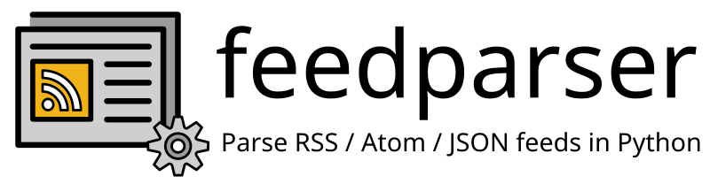

..
    This file is part of feedparser.
    Copyright 2010-2026 Kurt McKee <contactme@kurtmckee.org>
    Copyright 2002-2008 Mark Pilgrim
    Released under the BSD 2-clause license.

----

Installation
============

feedparser can be installed by running pip:

..  code-block:: console

    $ pip install feedparser

Documentation
=============

The feedparser documentation is available on the web at:

    https://feedparser.readthedocs.io/en/latest/

It can also be built and browsed locally using `tox`_:

..  code-block:: console

    $ tox run -e docs

This will produce HTML documentation in the ``build/docs/`` directory.

Testing
=======

Feedparser has an extensive test suite, powered by `tox`_:

..  code-block:: console

    $ tox run-parallel

..  Links
..  =====
..
..  _tox: https://tox.wiki/
